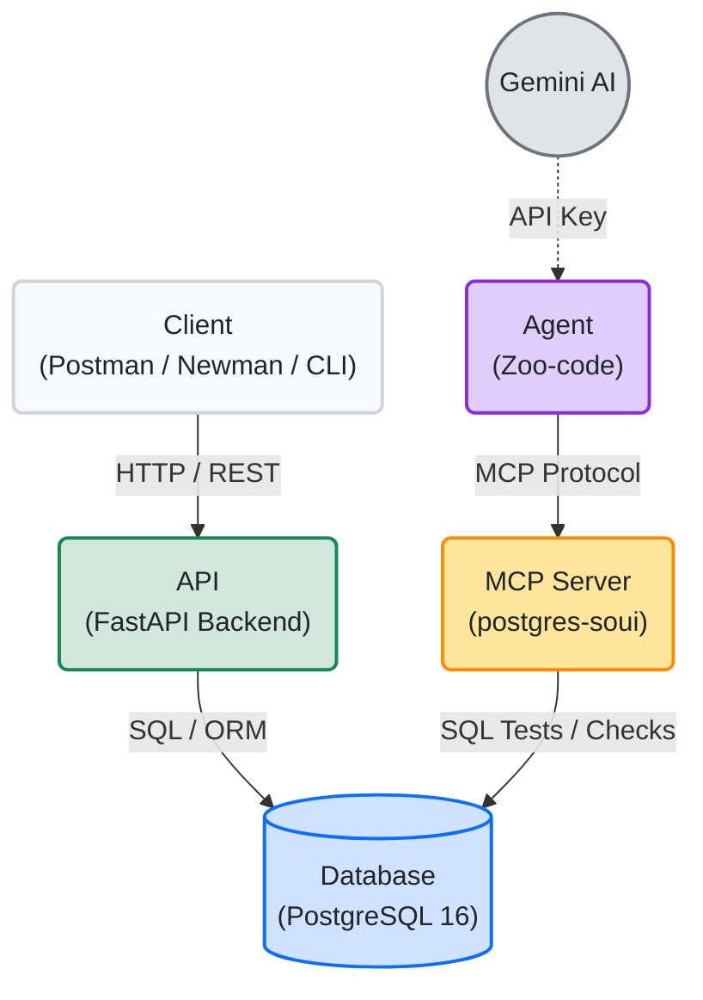

[](https://fastapi.tiangolo.com)
[](https://www.postgresql.org)
[](https://www.docker.com)


# 🎓 SOUI — QA Automation & AI-Driven Testing Hub

Практический тестовый стенд на базе **Системы Обработки Учебной Информации (СОУИ)**. Проект разработан для демонстрации навыков автоматизации тестирования, тестирование баз данных с помощью SQL и интеграции ИИ-агентов в реальный QA-процесс.

## 🎯 Ключевые особенности проекта
1. **Тестирование Backend & DB:** Проверка REST API (FastAPI) и проверка бизнес-ограничений и целостности данных (PostgreSQL 16) на уровне `CHECK`-ограничений, `FOREIGN KEY` (ON DELETE RESTRICT) и транзакций.
2. **AI-Driven QA via MCP:** Интеграция ИИ-агента через **Model Context Protocol (MCP)**. Агент напрямую анализирует схему базы данных, выполняет граничный анализ (BVA) и автоматически генерирует формализованные баг-репорты.
3. **Docs-as-Code:** Архитектура, тест-кейсы и баг-репорты ведутся в Markdown прямо в репозитории.

---

## 🏗️ Архитектура и интеграция ИИ



## 📂 Структура репозитория
```text
.
.
├── app/                  # Исходный код FastAPI сервиса (models, database)
├── docker/               # Инфраструктура: docker-compose и SQL-скрипты миграций
├── docs/                 # QA-документация:
│   ├── bug_reports/      #   Оформленные баг-репорты 
│   ├── diagrams/         #   Mermaid-схемы и ERD-диаграммы базы данных
│   └── test-management/  #   Тест-кейсы и отчёты о тестировании (QA_Checklist.md)
├── mcp/                  # Конфигурация Model Context Protocol для подключения агента
├── sql-tests/            # SQL-скрипты: проверка констрейнтов и целостности данных
├── tests/                # Коллекции Postman для автотестов API
└── .agent/prompts/       # (Скрытая директория) Промпты для AI-агента
```

---

## 🚀 Быстрый старт

Запуск проекта выполняется в одну команду с помощью Docker Compose:

```bash
git clone https://github.com/stasmeh/soui-qa-automation-hub.git
cd soui-qa-automation-hub
docker compose -f docker/docker-compose.yml up --build -d
```

* **Swagger UI (FastAPI):** [http://localhost:8000/docs](http://localhost:8000/docs)
* **PostgreSQL:** `localhost:5432` (User: `qa_admin`, DB: `soui_db`)

---

## 🤖 Как работает ИИ-агент (AI-Assisted QA)

ИИ-агент (`Zoo-code` / `Cline`) подключается к PostgreSQL через `postgres-soui` сервер и выполняет задачи по заготовленным промптам (директория [`.agent/prompts/`](.agent/prompts/)):

1. **Анализ схемы БД:** Агент запрашивает структуру таблиц и выявляет расхождения с требованиями (например, неверные регулярные выражения в `CHECK`).
2. **Генерация проверок:** Создает чек-листы и SQL-тесты на основе структуры таблиц (`02_crud_testing.prompt.md`).
3. **Оформление багов:** Анализирует ошибки СУБД (например, нарушение CHECK constraint) и оформляет структурированные баг-репорты по Jira-шаблону (`05_bug_reporter.prompt.md`).

Подробное руководство по настройке агента: [`AI_Agent_Demo_Guide.md`](docs/AI_Agent_Demo_Guide.md).

---

## 🧪 Запуск тестов

1. **API-автотесты (Postman + Newman):**
   ```bash
   npm install
   npm run test:api
   ```

2. **Интеграционные SQL-тесты целостности БД:**
   ```bash
   docker exec -i soui_qa_db psql -U qa_admin -d soui_db < sql-tests/01_integrity_and_constraints.sql
   ```

---

## 👤 Автор

Станислав Меховский | QA Engineer

* GitHub: [@stasmeh](https://github.com/stasmeh)
* Telegram: [marselle2021](https://t.me/marselle2021)

## Источники

Промты для AI-агента в директории `.agent/prompts/` основаны на материалах из репозитория
[QA Prompt Library](https://github.com/tayyabakmal1/qa-prompt-library) (автор: Tayyab Akmal).
Оригинальные промты были адаптированы и модифицированы под контекст проекта SOUI.
Лицензия: MIT.