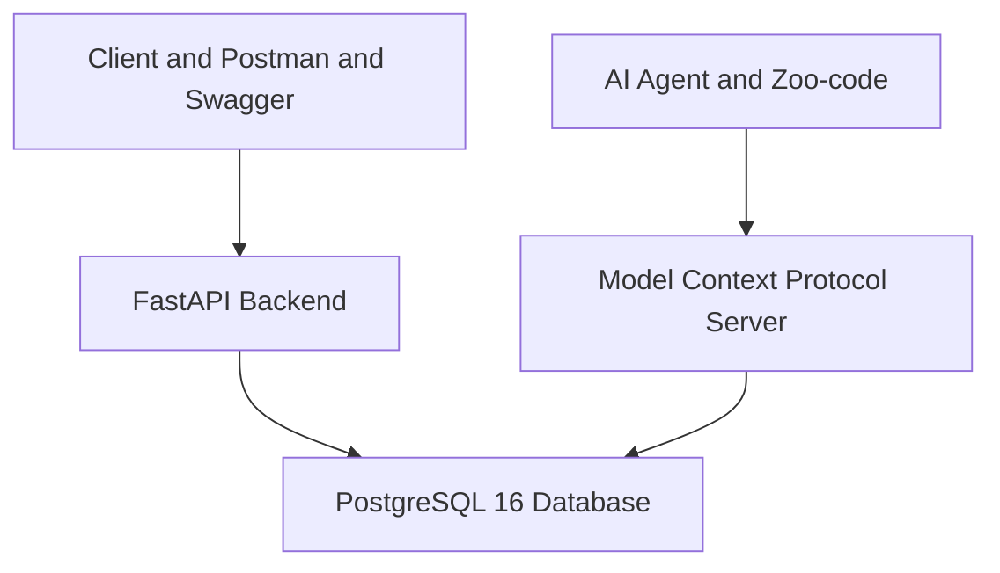

[](https://fastapi.tiangolo.com)
[](https://www.postgresql.org)
[](https://www.docker.com)
[](https://www.python.org)
[](https://opensource.org/licenses/MIT)

# 🎓 СОУИ — QA Engineering Hub & AI-Assisted QA Sandbox

Комплексный тестовый стенд и демонстрационное портфолио для **Системы Обработки Учебной Информации (СОУИ)**. Проект создан как эталонный пример современных подходов к обеспечению качества (QA): от классического тест-дизайна, SQL-валидации и REST API тестирования (Postman/Newman) до интеграции AI-агентов через Model Context Protocol (MCP).

---

## 🎯 Ценность проекта для рекрутеров и нанимающих менеджеров

* **Для IT-рекрутеров:** 
  * Готовый **production-like тестовый стенд**, разворачиваемый одной командой через Docker Compose.
  * Демонстрация владения актуальным стеком: **FastAPI, PostgreSQL 16, Docker, Postman, CI/CD**.
  * Наглядные примеры артефактов тестирования: тест-кейсы, тест-планы, баг-репорты в формате Jira, спецификации БД (ERD) и интеграция с ИИ.

* **Для Lead QA & Hiring Managers:**
  * Прозрачная архитектура и структурированный тест-дизайн ([`Test Cases Suite`](docs/test-management/Test_Cases_Suite.md)).
  * Использование современных инспекционных инструментов — **Model Context Protocol (MCP)** для прямого взаимодействия ИИ-агентов с реляционной базой данных.
  * Набор структурированных системных промптов ([`.agent/prompts/`](.agent/prompts/01_test_designer.prompt.md)) для автоматизации задач тестирования, граничного анализа и генерации дефектов.

---

## 🏗️ Архитектура системы и AI-тестирования



### Технологический стек
* **Backend / API:** Python 3.11, FastAPI, SQLAlchemy, Pydantic, Uvicorn
* **Database:** PostgreSQL 16 (с CHECK-ограничениями, внешними ключами и ссылочной целостностью)
* **API Testing & Automation:** Postman Collection ([`soui_postman_collection.json`](tests/soui_postman_collection.json)), Newman CLI, Swagger UI / ReDoc
* **AI Integration & MCP:** Model Context Protocol [`postgres-soui`](mcp/cline_mcp_settings.json), Zoo-code (форк Roo-code) в GitHub Codespaces, Google Gemini API
* **CI/CD & DevOps:** Docker Compose ([`docker-compose.yml`](docker/docker-compose.yml)), GitHub Actions ([`.github/workflows/qa.yml`](.github/workflows/qa.yml))

---

## 🚀 Быстрый старт (Запуск за 2 минуты)

### Предварительные требования
* Docker Engine (20.10+) & Docker Compose (v2+)
* Свободные порты: `8000` (FastAPI) и `5432` (PostgreSQL)

### Запуск сервисов
```bash
# Клонирование репозитория
git clone https://github.com/stasmeh/soui-qa-automation-hub.git
cd soui-qa-automation-hub

# Копирование файла переменных окружения (опционально)
cp .env.example .env

# Запуск контейнеров в фоновом режиме
docker compose -f docker/docker-compose.yml up --build -d
```

### Полезные ссылки после запуска:
* **Swagger API UI:** [`http://localhost:8000/docs`](http://localhost:8000/docs)
* **ReDoc API Documentation:** [`http://localhost:8000/redoc`](http://localhost:8000/redoc)
* **PostgreSQL Connection:** `localhost:5432` (База: `soui_db`, Пользователь: `qa_admin`, Пароль: `qa_secure_password`)

---

## 🤖 AI-Driven QA Workflow (Интеграция ИИ и MCP)

Проект демонстрирует передовую практику использования **ИИ-агентов в роли QA-инженера**. Благодаря **Model Context Protocol (MCP)**, AI-агент получает защищенный контекстный доступ к структуре базы данных PostgreSQL, что позволяет выполнять глубокую валидацию данных, генерировать тест-кейсы и находить несоответствия бизнес-логике.

### Структура системных промптов ([`.agent/prompts/`](.agent/prompts/01_test_designer.prompt.md)):
1. [`01_test_designer.prompt.md`](.agent/prompts/01_test_designer.prompt.md) — Проектирование тест-кейсов и стратегии тестирования.
2. [`02_crud_testing.prompt.md`](.agent/prompts/02_crud_testing.prompt.md) — Методология тестирования CRUD-операций REST API.
3. [`03_field_validation.prompt.md`](.agent/prompts/03_field_validation.prompt.md) — Валидация полей и граничных значений (Boundary Value Analysis).
4. [`04_reports_testing.prompt.md`](.agent/prompts/04_reports_testing.prompt.md) — Проверка аналитических отчетов и агрегирующих SQL-запросов.
5. [`05_bug_reporter.prompt.md`](.agent/prompts/05_bug_reporter.prompt.md) — Формирование стандартизированных баг-репортов профессионального уровня.

*Подробное руководство по демонстрации возможностей ИИ-агента приведено в [`AI_Agent_Demo_Guide.md`](docs/AI_Agent_Demo_Guide.md).*

---

## 📂 Качество и артефакты QA (Quality Assurance Deliverables)

Репозиторий содержит исчерпывающий набор документации и артефактов ручного и автоматизированного тестирования:

* **Тест-дизайн:**
  * [`Test Cases Suite`](docs/test-management/Test_Cases_Suite.md) — Полная матрица тест-кейсов (позитивные, негативные, граничные).
  * `docs/diagrams/erd_schema_soui.jpg` — ERD-диаграмма базы данных СОУИ.
  * `docs/diagrams/mindmap_soui.jpg` — Интеллект-карта покрытия тестирования (MindMap).

* **Примеры дефектов (Jira-style Bug Reports):**
  * [`BUG_001_group_code_hyphen_check.md`](docs/BUG_001_group_code_hyphen_check.md) — Пример детального баг-репорта по валидации дефисов в коде студенческих групп.
  * [`sample_bug_report.md`](docs/generated/sample_bug_report.md) — Сгенерированный ИИ-агентом отчет о дефекте.

* **SQL-валидация и проверки целостности:**
  * [`01_integrity_and_constraints.sql`](sql-tests/01_integrity_and_constraints.sql) — SQL-скрипты проверки ограничений CHECK, FK и уникальности.
  * [`02_business_logic_reports.sql`](sql-tests/02_business_logic_reports.sql) — Сводные SQL-отчеты по бизнес-логике успеваемости.

---

## 🧪 Запуск проверок и тестов

### 1. Запуск SQL-тестов целостности БД
```bash
# Проверка CHECK-ограничений и ссылочной целостности
docker exec -i soui_qa_db psql -U qa_admin -d soui_db < sql-tests/01_integrity_and_constraints.sql

# Генерация сводного отчета успеваемости
docker exec -i soui_qa_db psql -U qa_admin -d soui_db < sql-tests/02_business_logic_reports.sql
```

### 2. Запуск API-тестов через Postman / Newman
```bash
# Установка зависимостей Node.js (при необходимости)
npm install

# Запуск автотестов API через Newman
npm run test:api
```

---

## 👤 Автор и Контакты

* **QA Engineer / Automation:** Станислав Меховский ([@stasmeh](https://github.com/stasmeh))
* **Репозиторий:** [soui-qa-automation-hub](https://github.com/stasmeh/soui-qa-automation-hub)
* **Лицензия:** MIT
