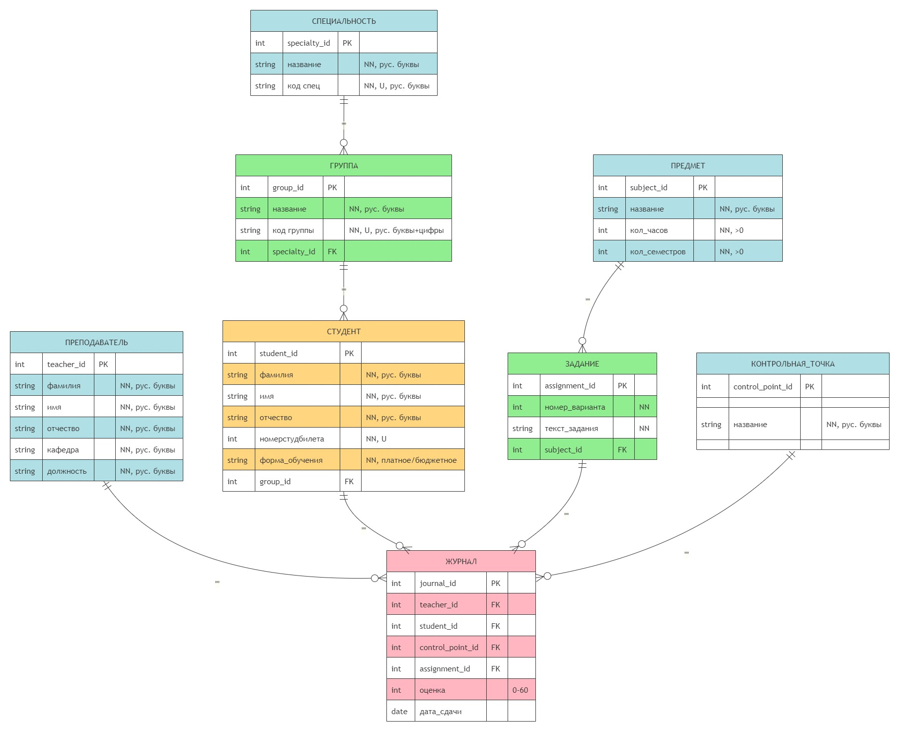
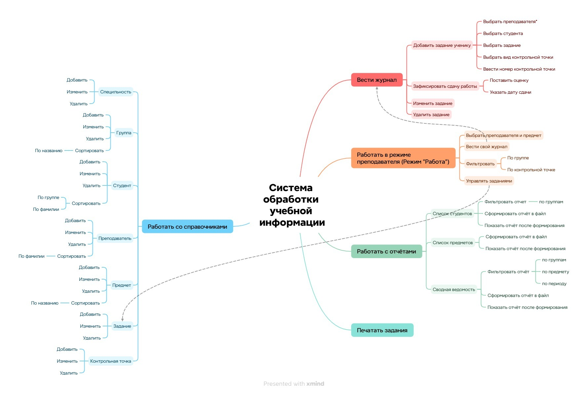

# 🎓 СОУИ — QA Engineering Hub (Sandbox with Gemini & MCP)

Тестовый стенд и комплекс обеспечения качества для **Системы Обработки Учебной Информации (СОУИ)**. Проект служит учебной песочницей для практической демонстрации навыков тестирования REST API, реляционных баз данных (PostgreSQL), анализа сетевого трафика (Charles Proxy), а также интеграции ИИ-агентов на базе моделей Gemini через протокол Model Context Protocol (MCP).

---

## 🛠️ Технологический стек проекта

* **Backend / API**: Python 3.11, FastAPI, SQLAlchemy, Pydantic, Uvicorn
* **Database**: PostgreSQL 16
* **QA & Test Design**: Test Cases Suite, ERD-диаграммы, MindMap (XMind)
* **API Testing Tools**: Postman (коллекция в репозитории), Swagger / ReDoc
* **Traffic Inspection**: Charles Proxy
* **AI Integration**: Model Context Protocol (MCP), Gemini Prompts (в `.agent/prompts/`)
* **DevOps**: Docker, Docker Compose

---

## 📌 Структура проекта и артефакты

```text
soui-qa-automation-hub/
├── .agent/prompts/             # Промпты для AI QA-агента (Gemini)
│   ├── qa_analyst.prompt.md    # Инструкция по генерации тест-кейсов по ISO/IEC/IEEE 29119
│   ├── sql_validator.prompt.md # Скрипт-промпт для аудита ограничений схемы БД
│   └── bug_reporter.prompt.md  # Шаблон для локализации и оформления баг-репортов
├── app/                        # REST API бэкенд на FastAPI
│   ├── database.py             # Подключение к PostgreSQL через SQLAlchemy
│   ├── main.py                 # Эндпоинты для 8 сущностей системы
│   ├── models.py               # ORM-модели таблиц
│   └── requirements.txt        # Список зависимостей Python
├── docker/                     # Контейнеризация
│   ├── docker-compose.yml      # Оркестрация контейнеров API и СУБД
│   └── init-db/                # DDL схемы и начальные данные PostgreSQL
├── docs/                       # Тестовая документация
│   ├── diagrams/               # Архитектурная MindMap и ER-диаграмма
│   └── test-management/        # Набор тест-кейсов (Test Cases Suite)
├── mcp/                        # Конфигурация Model Context Protocol для ИИ-агентов
├── sql-tests/                  # SQL-скрипты проверки бизнес-правил СУБД
└── tests/                      # Инструменты тестирования API
    └── soui_postman_collection.json # Импортируемая коллекция запросов Postman с тестами
```

---

## ⚙️ Инструкция по запуску стенда

Стенд полностью контейнеризирован. Для развертывания веб-сервиса и базы данных PostgreSQL с автоматическим накатыванием схемы данных и тестового наполнения выполните в консоли:

```bash
docker-compose -f docker/docker-compose.yml up --build -d
```

Интерфейсы запущенной системы:
* **Интерактивная документация Swagger API**: `http://localhost:8000/docs`
* **Альтернативная документация ReDoc**: `http://localhost:8000/redoc`
* **База данных PostgreSQL**: доступна по порту `5432` (логин: `qa_admin`, пароль: `qa_secure_password`).

---

## 📑 Описание реализованных QA-активностей

### 1. Тестирование баз данных (Database Testing)
В папке `sql-tests/` подготовлены SQL-скрипты для валидации ограничений целостности данных:
* `01_integrity_and_constraints.sql`: Проверка `CHECK`-констреинтов (валидация ФИО на кириллицу, диапазон оценок `0-60`) и ограничений ссылочной целостности (`ON DELETE RESTRICT` на связях).
* `02_business_logic_reports.sql`: Аналитический SQL-запрос для формирования сводной успеваемости и выявления задолженностей студентов.

### 2. Тест-дизайн и тест-кейсы
В файле [`docs/test-management/Test_Cases_Suite.md`](docs/test-management/Test_Cases_Suite.md) описаны тест-кейсы для всех разделов системы. Применены следующие техники тест-дизайна:
* Анализ граничных значений (BVA) для проверки лимита оценок в журнале (`0–60` баллов).
* Эквивалентное разделение (EP) для валидации полей ФИО (кириллица/латиница).
* Таблица переходов состояний (State Transition) для жизненного цикла записи успеваемости в журнале.

### 3. Тестирование API (Postman)
В папке `tests/` находится файл `soui_postman_collection.json`. Коллекция включает:
* Сгруппированные по папкам REST API запросы к FastAPI.
* Встроенные JS-тесты (проверки статус-кодов, соответствие форматов ответов JSON Schema).
* Переменные окружения для гибкого переключения хоста.

### 4. Интеграция с ИИ-агентами (Gemini & MCP)
Репозиторий адаптирован для совместной работы с ИИ-агентами (например, плагинами Cline, Cursor) через протокол **Model Context Protocol (MCP)**:
* Файл `mcp/cline_mcp_settings.json` содержит конфигурацию подключения агента к PostgreSQL.
* Инструкции в `.agent/prompts/` (например, `qa_analyst.prompt.md`) позволяют ИИ читать схему базы данных напрямую, проводить сверку ожидаемого и фактического состояний данных в СУБД, а также автоматизировать написание баг-репортов.

## 📊 Схемы и диаграммы

Ниже представлены ER-диаграмма базы данных и интеллект-карта архитектуры системы.

### ER-диаграмма


### MindMap

