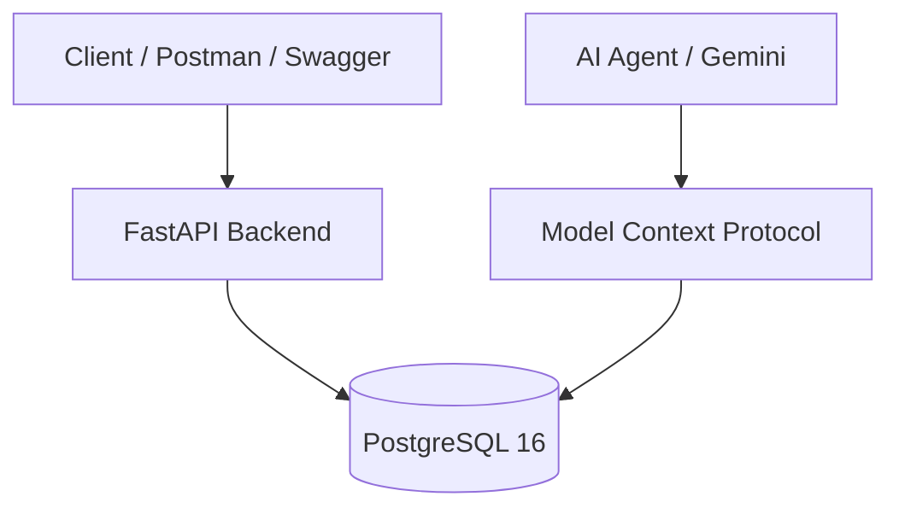

[](https://fastapi.tiangolo.com)
[](https://www.postgresql.org)
[](https://www.docker.com)
[](https://www.python.org)
[](https://opensource.org/licenses/MIT)

# 🎓 СОУИ — QA Engineering Hub & AI Sandbox

Комплексный тестовый стенд и портфолио для **Системы Обработки Учебной Информации (СОУИ)**. Проект демонстрирует практики тестирования REST API, реляционных БД (PostgreSQL), тест-дизайна, а также интеграцию ИИ-агентов через Model Context Protocol (MCP).

---

## 🏗️ Архитектура системы



---

## 🛠️ Технологический стек

* **Backend / API**: Python 3.11, FastAPI, SQLAlchemy, Pydantic, Uvicorn
* **Database**: PostgreSQL 16 (с CHECK-ограничениями и ссылочной целостностью)
* **QA & Test Design**: [`Test Cases Suite`](docs/test-management/Test_Cases_Suite.md), ERD-диаграммы, MindMap
* **API Testing**: Postman Collection [`soui_postman_collection.json`](tests/soui_postman_collection.json), Newman CLI, Swagger / ReDoc
* **AI Integration**: Model Context Protocol [`cline_mcp_settings.json`](mcp/cline_mcp_settings.json), промпты в [`qa_analyst.prompt.md`](.agent/prompts/qa_analyst.prompt.md)
* **DevOps**: Docker, Docker Compose [`docker-compose.yml`](docker/docker-compose.yml)

---

## 🚀 Быстрый старт (Quick Start)

### Предварительные требования
* Docker Engine (20.10+) & Docker Compose (v2+)
* Свободные порты: `8000` (FastAPI) и `5432` (PostgreSQL)

### Запуск сервисов
```bash
docker-compose -f docker/docker-compose.yml up --build -d
```

* **Swagger API**: `http://localhost:8000/docs`
* **ReDoc API**: `http://localhost:8000/redoc`
* **PostgreSQL**: `localhost:5432` (`soui_db` / `qa_admin` / `qa_secure_password`)

---

## 🧪 Запуск тестов

### 1. SQL-валидация и проверки целостности
```bash
# Проверка CHECK-ограничений и целостности
docker exec -i soui_qa_db psql -U qa_admin -d soui_db < sql-tests/01_integrity_and_constraints.sql

# Сводный отчет успеваемости
docker exec -i soui_qa_db psql -U qa_admin -d soui_db < sql-tests/02_business_logic_reports.sql
```

### 2. API-тесты (Postman / Newman)
```bash
npx newman run tests/soui_postman_collection.json --env-var "baseUrl=http://localhost:8000"
```

---

## 📂 Навигация по репозиторию

* [`app/`](app/main.py) — Исходный код FastAPI бэкенда и моделей БД.
* [`docker/`](docker/docker-compose.yml) — Конфигурация Docker и скрипты инициализации БД (`01_schema.sql`, `02_seed_data.sql`).
* [`docs/`](docs/AI_Agent_Demo_Guide.md) — Документация, тест-кейсы, ERD-диаграммы (`erd_schema_soui.jpg`) и MindMap (`mindmap_soui.jpg`).
* [`sql-tests/`](sql-tests/01_integrity_and_constraints.sql) — SQL-скрипты проверки бизнес-логики и ограничений.
* [`tests/`](tests/soui_postman_collection.json) — Коллекция Postman для тестирования API.
* [`.agent/`](.agent/prompts/qa_analyst.prompt.md) — Промпты для AI QA-агентов (Gemini) и конфигурация MCP [`cline_mcp_settings.json`](mcp/cline_mcp_settings.json).

---

## 👤 Автор

* **QA Engineer**: Станислав Меховский ([@stasmeh](https://github.com/stasmeh))
* **Репозиторий**: [soui-qa-automation-hub](https://github.com/stasmeh/soui-qa-automation-hub)
