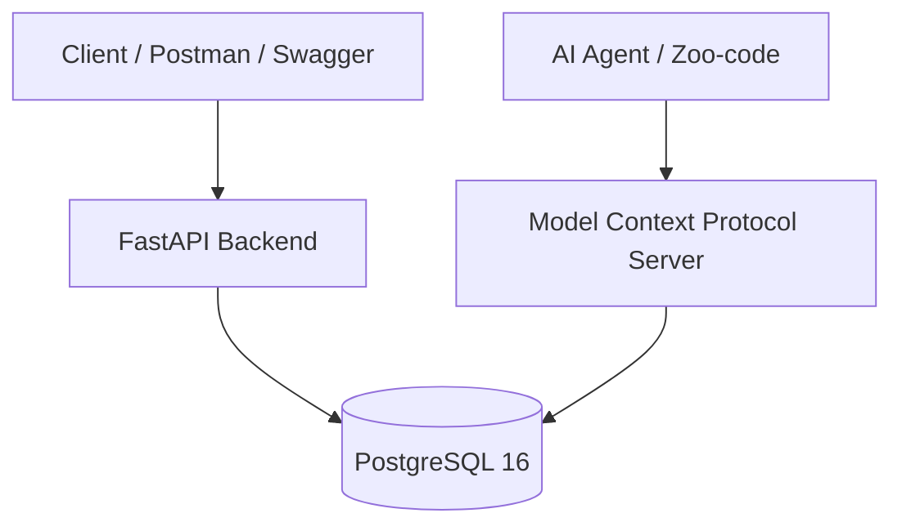

[](https://fastapi.tiangolo.com)
[](https://www.postgresql.org)
[](https://www.docker.com)
[](https://www.python.org)
[](https://opensource.org/licenses/MIT)

# 🎓 СОУИ — QA Testbed & AI-Assisted Automation Hub

Практический тестовый стенд на базе **Системы Обработки Учебной Информации (СОУИ)**. 

### Для чего этот проект:
1. **Тестирование backend-системы:** Проверка REST API (FastAPI) и валидация реляционной СУБД (PostgreSQL 16) на уровне CHECK-ограничений, внешних ключей и целостности связей.
2. **Интеграция ИИ в QA-процессы:** Демонстрация работы ИИ-агента через **Model Context Protocol (MCP)** для прямого анализа схемы БД, граничного анализа (BVA) и автоматического составления баг-репортов.

---

## 🏗️ Архитектура



* **Backend / API:** Python 3.11, FastAPI, SQLAlchemy, Pydantic
* **Database:** PostgreSQL 16 (с CHECK-ограничениями и транзакциями)
* **API Testing:** Postman Collection ([`soui_postman_collection.json`](tests/soui_postman_collection.json)), Newman CLI
* **AI & MCP:** Model Context Protocol (`postgres-soui`), Zoo-code (GitHub Codespaces), Gemini API
* **DevOps:** Docker Compose ([`docker-compose.yml`](docker/docker-compose.yml)), GitHub Actions CI/CD

---

## 🚀 Быстрый старт (Запуск в 1 команду)

### Запуск окружения
```bash
# Клонирование и запуск в Docker
git clone https://github.com/stasmeh/soui-qa-automation-hub.git
cd soui-qa-automation-hub
docker compose -f docker/docker-compose.yml up --build -d
```

### Доступ к сервисам:
* **Локальный запуск (Docker Desktop):** [http://localhost:8000/docs](http://localhost:8000/docs)
* **Запуск в GitHub Codespaces:** Вкладка `Ports` внизу экрана → порт `8000` (Forwarded Address) → значок «Open in Browser»
* **Подключение к PostgreSQL (psql / DBeaver / MCP):** `localhost:5432` (`soui_db` / `qa_admin` / `qa_secure_password`)

---

## 🤖 AI-Driven QA & Системные промпты

ИИ-агент подключается к PostgreSQL через MCP (`postgres-soui`) и выполняет сценарии тестирования по готовым промптам из папки [`.agent/prompts/`](.agent/prompts/):

1. [`01_test_designer.prompt.md`](.agent/prompts/01_test_designer.prompt.md) — Проектирование тест-кейсов и матрицы покрытия.
2. [`02_crud_testing.prompt.md`](.agent/prompts/02_crud_testing.prompt.md) — Тестирование CRUD-операций REST API.
3. [`03_field_validation.prompt.md`](.agent/prompts/03_field_validation.prompt.md) — Валидация полей и анализ граничных значений (BVA).
4. [`04_reports_testing.prompt.md`](.agent/prompts/04_reports_testing.prompt.md) — Проверка аналитических отчетов и SQL-агрегаций.
5. [`05_bug_reporter.prompt.md`](.agent/prompts/05_bug_reporter.prompt.md) — Автоматическая генерация баг-репортов по стандарту.

Подробное руководство: [`AI_Agent_Demo_Guide.md`](docs/AI_Agent_Demo_Guide.md).

---

## 📂 Артефакты тестирования

* **Тест-кейсы:** [`Test_Cases_Suite.md`](docs/test-management/Test_Cases_Suite.md)
* **Баг-репорты:** [`BUG_001_group_code_hyphen_check.md`](docs/BUG_001_group_code_hyphen_check.md) (дефект регулярного выражения в схеме БД)
* **Схема данных:** [`erd_schema_soui.jpg`](docs/diagrams/erd_schema_soui.jpg), [`mindmap_soui.jpg`](docs/diagrams/mindmap_soui.jpg)
* **SQL-проверки:** [`01_integrity_and_constraints.sql`](sql-tests/01_integrity_and_constraints.sql), [`02_business_logic_reports.sql`](sql-tests/02_business_logic_reports.sql)

---

## 🧪 Запуск тестов вручную

```bash
# 1. Запуск SQL-тестов целостности БД
docker exec -i soui_qa_db psql -U qa_admin -d soui_db < sql-tests/01_integrity_and_constraints.sql

# 2. Запуск API-автотестов через Newman
npm install && npm run test:api
```

---

## 👤 Автор

* **QA Engineer:** Станислав Меховский ([@stasmeh](https://github.com/stasmeh))
